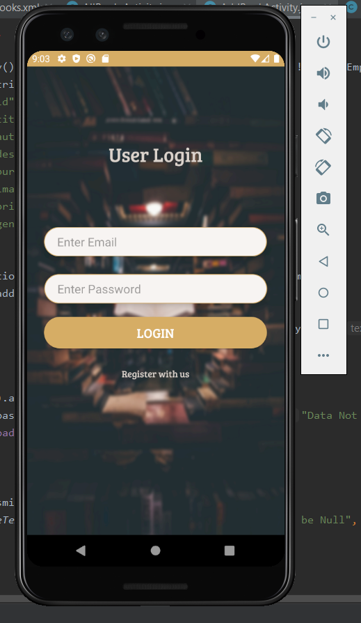
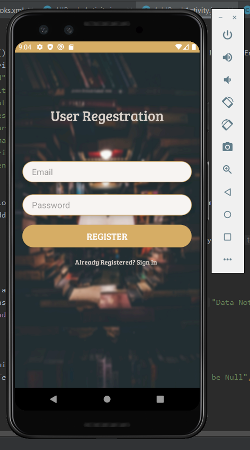
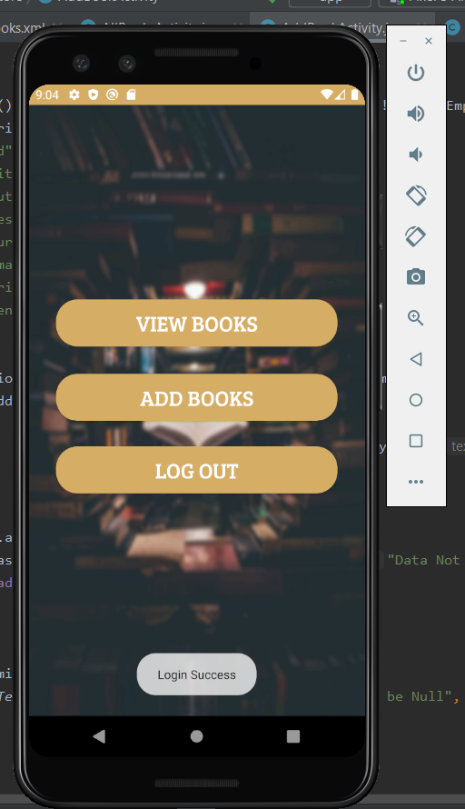
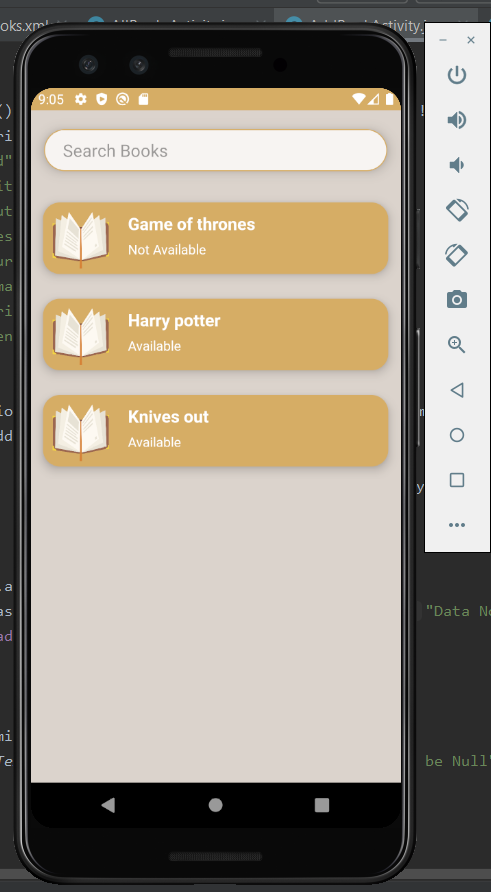
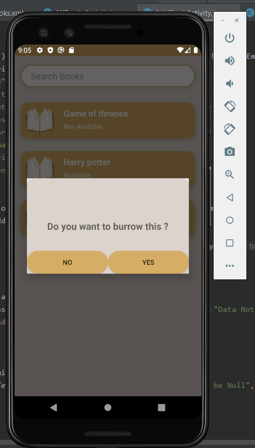
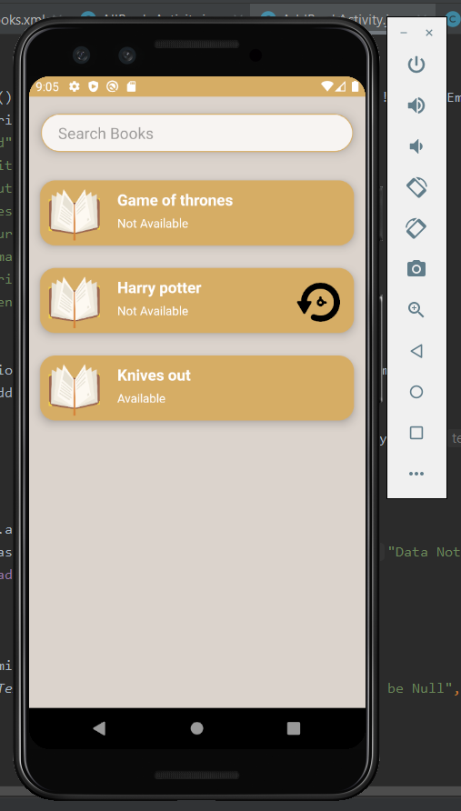
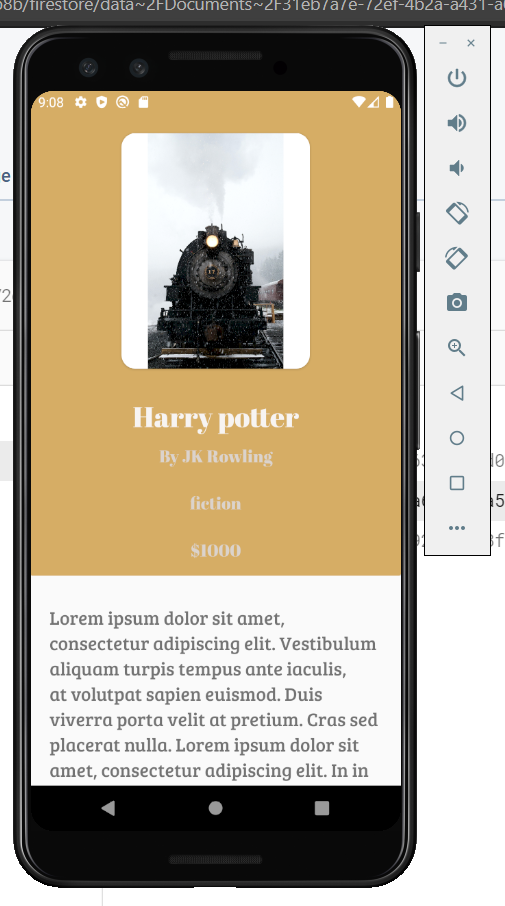

# book-store

User can register to the application in register page or user can login to the app using already registered user credentials
email - jj@gmail.com
password - 123456

email - pp@gmail.com
password - 123456

after login user will be directed to the main activity page there will be three options to add a new book, logout from the app and view all the books in the library as a list

user can long press on the preffered book to burrow it, after some user burrowed a certain book that book will be shown as not available to the users while return icon will be displayed to the burrowed user, user can return the book by clicking on the return button on the book item in the list after that returned book will be available to all the users untill another user burrow it. if use want to get informations regarding the selected book user should click on the book item then book detail page will be opened.

